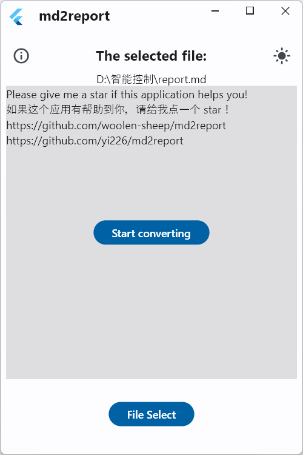
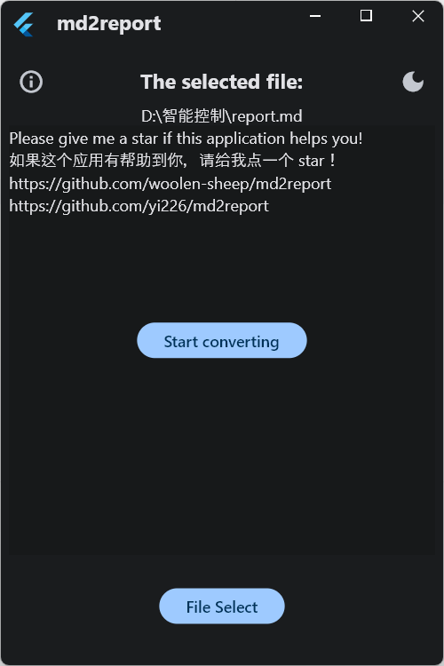

# md2report app

A GUI application for [md2report: 一个用于将Markdown文件转换为可以直接提交给学校的docx实验报告/大作业报告/期末小论文的工具](https://github.com/woolen-sheep/md2report).

## Quick Start

1. 安装[Pandoc](https://pandoc.org/installing.html)
2. 下载最新Release压缩包并解压后，运行md2report.exe

## Features

- [x] 打包好的Python环境
- [x] 图形化界面
- [x] Pandoc环境检测

## Examples

|          Light           |          Dark           |
| :----------------------: | :---------------------: |
|  |  |

